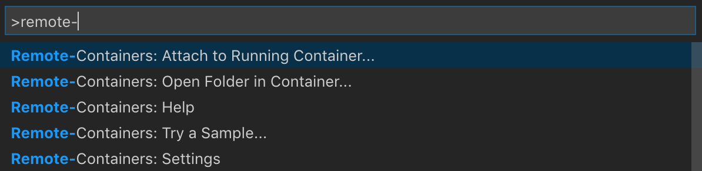

# terragrunt-reference
Reference Layout for Terragrunt / Terraform

## Setup
The structure of this repository is a reccomended layout for using Terragrunt with Terraform.

It contains a folder structure and configuration for Visual Studio Code to build and run within a contained environment with all the required dependancies.

Note: SSH keys are expected to be in ```~/.ssh/id_rsa``` and are mounted read-only within the environment.

Each top level folder can be split into separate repositories, however the structure should be kept (use sub-modules)

## How is the code in this repo organized?

The code in this repo uses the following folder hierarchy:
 
```
environments
 └ [account]
   └ _global
   └ [region]
      └ _global
      └ [environment]
         └ resource

modules
 └ [module]
```

Where:

* **Account**: At the top level are each of your AWS accounts or Azure Resource such as `sandbox`, `staging`, `production`, `management`, 
  etc. If you have everything deployed in a single AWS account, there will just be a single folder at the root (e.g. 
  `main-account`).
  
* **Region**: Within each account, there will be one or more [AWS 
  regions](http://docs.aws.amazon.com/AWSEC2/latest/UserGuide/using-regions-availability-zones.html), such as 
  `us-east-1`, `eu-west-1`, and `ap-southeast-2`, where you've deployed resources. There may also be a `_global` 
  folder that defines resources that are available across all the AWS regions in this account, such as IAM users, 
  Route 53 hosted zones, and CloudTrail. 

* **Environment**: Within each region, there will be one or more "environments", such as `qa`, `stage`, etc. Typically, 
  an environment will correspond to a single [AWS Virtual Private Cloud (VPC)](https://aws.amazon.com/vpc/), which 
  isolates that environment from everything else in that AWS account. There may also be a `_global` folder 
  that defines resources that are available across all the environments in this region, such as DNS records.
  
* **Resource**: Within each environment, you deploy all the resources for that environment, such as Server Instances, Auto
  Scaling Groups, K8 Clusters, Databases, Load Balancers, and so on. Note that the Terraform code for most of these
  resources lives in the [terragrunt-infrastructure-modules-example repo](https://github.com/gruntwork-io/terragrunt-infrastructure-modules-example).

* **Module**: Each self contained module is created within it's own 


## Usage

To use this repository, the ideally approach is to use Visual Studio Code and the following extensions:
- Remote - Containers
- Visual Studio IntelliCode
- Docker

You should then see the remote button in the bottom left.


To get a command prompt just 'open folder in container'



The **Visual Studio Code Remote - Containers** extension lets you use a [Docker container](https://docker.com) as a full-featured development environment. It allows you to open any folder inside (or mounted into) a container and take advantage of Visual Studio Code's full feature set. A `devcontainer.json` file in your project tells VS Code how to access (or create) a **development container** with a well-defined tool and runtime stack. This container can be used to run an application or to sandbox tools, libraries, or runtimes needed for working with a codebase.

Workspace files are mounted from the local file system or copied or cloned into the container. Extensions are installed and run inside the container, where they have full access to the tools, platform, and file system. This means that you can seamlessly switch your entire development environment just by connecting to a different container.


This lets VS Code provide a **local-quality development experience** — including full IntelliSense (completions), code navigation, and debugging — **regardless of where your tools (or code) are located**.